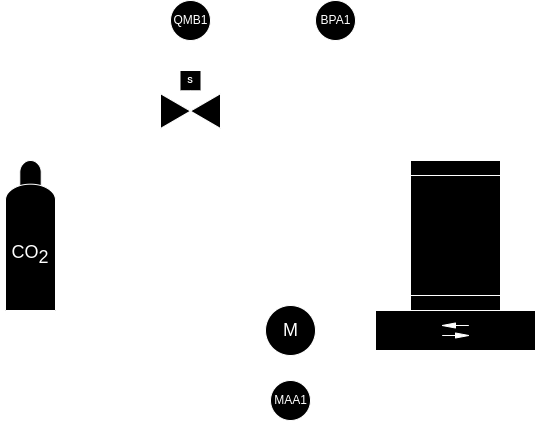
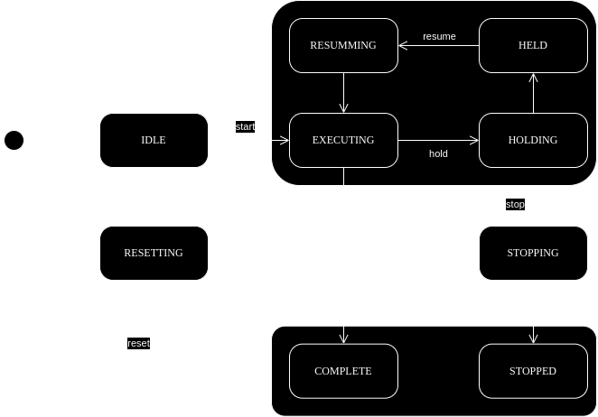
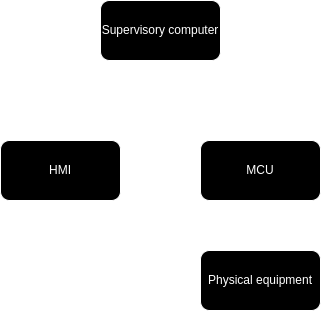
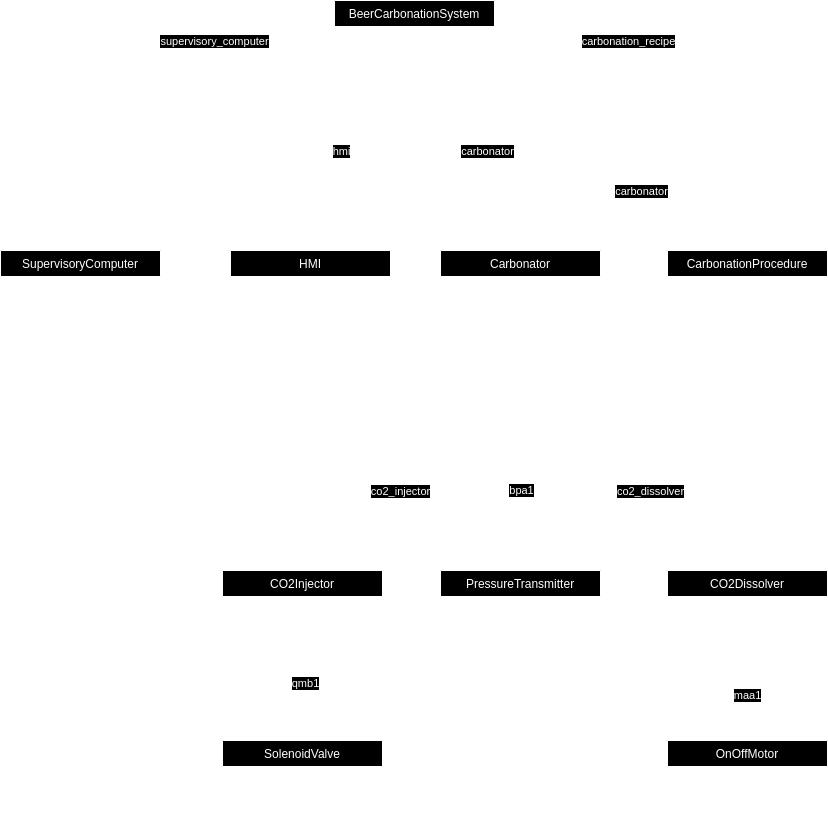
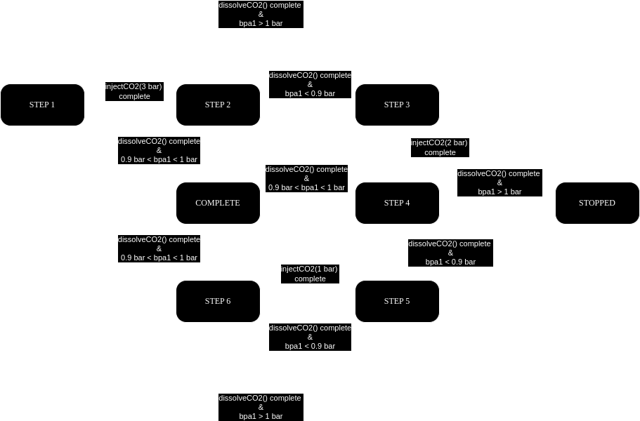
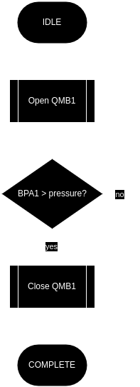
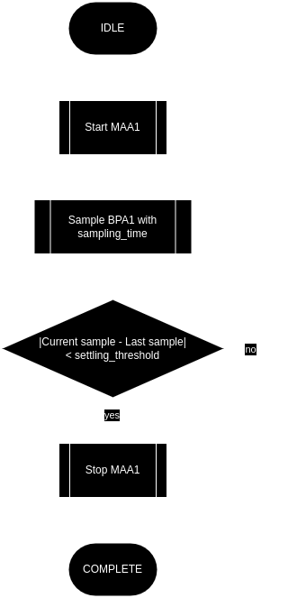
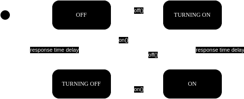

# Sistema de carbonatación de cerveza

## TODO:
* Implementar soporte para alarmas.
* Implementar soporte para botones táctiles del HMI.

## Alumno
Hernán Leandro Bailo

## Objetivo
Desarrollar un sistema de carbonatación de cerveza en barriles.

## Descripción del proceso
El diagrama P&ID del sistema de carbonatación se muestra a continuación.

El sistema consiste en un tanque de CO2 conectado a un barril de cerveza a través de la válvula solenoide QMB1. El barril se encuentra montado sobre una criba vibratoria que se acciona mediante el motor eléctrico MAA1. La presión interna del barril se mide con el sensor BPA1.

### Fases del proceso
* Inyección de CO2: Accionando la válvula solenoide (normalmente cerrada) (QMB1) se inyecta CO2 al barril de cerveza. La cantidad de gas inyectado se mide a través de la presión del barril (BPA1).

* Disolución del CO2: Encendiendo la criba vibratoria (MAA1) se agita la cerveza y se favorece la disolución del CO2. El grado de disolución se mide indirectamente a través de la presión del barril (BPA1). A medida que el CO2 se diluye en la cerveza BPA1 decrece y se establece en un determinado valor. Se asume que se completó la disolución cuando dos muestras sucesivas de BPA1 con una separación de 1s difieren en menos de 10 mbar.

### Receta de carbonatación
A continuación se describen los pasos de la receta de carbonatación implementada.

1. Se inyectan 3 bares de CO2 al barril accionando QMB1 hasta que BPA1 = 3 bar.
2. Se diluye el CO2 encendiendo la criba vibratoria. Si una vez diluido el gas se mide 0.9 bar < BPA1 < 1 bar entonces se finaliza la receta con el barril correctamente carbonatado, sino si BPA1 < 0.9 bar se pasa al paso 3. 
3. Se inyectan 2 bares de CO2.
4. Se diluye el CO2 y si 0.9 bar < BPA1 < 1 bar se finaliza satisfactoriamente la receta, sino si BPA1 < 0.9 bar se pasa al paso 5.
5. Se inyecta 1 bar de CO2.
6. Se diluye el CO2 y si 0.9 bar < BPA1 < 1 bar se finaliza satisfactoriamente la receta, sino si BPA1 < 0.9 bar se repiten los pasos 5 y 6 indefinidamente.

Nota: en los pasos 2, 4 y 6 la condición BPA1 > 1 bar detiene la receta dado que no debería producirse si el sistema funciona adecuadamente. Se debe revisar el equipo.

### Operación
La operación del sistema se basa en la ejecución de la receta de carbonatación.

El operador controla el estado de la receta a través de los siguientes comandos:

* Start:  inicia la receta.
* Stop:   detiene la receta.
* Hold:   pausa la receta.
* Resume: reanuda la receta.
* Reset:  reinicia la receta.

Los comandos se encuentran ligados con los estados de la receta de acuerdo al siguiente diagrama:

### Alarmas y acciones de protección

* BPA1 > 4 bar: se detiene el proceso, se indica la alarma en el HMI, se activa la sirena y se envía un mensaje a la computadora de supervisión.

## Arquitectura de control
A continuación se muestra un esquemático de los módulos de hardware del sistema y se procede con las especificaciones de los mismos.

### Microcontrolador
El control del sistema se realiza con una placa NUCLEO-F429ZI que posee el microcontrolador STM32F249ZI.

#### Periféricos
* DIGITAL OUT 1: Señal de actuación de la válvula solenoide QMB1.
* DIGITAL OUT 2: Señal de actuación del motor MAA1 de la criba vibratoria.
* DIGITAL OUT 3: Señal de actuación de la sirena.
* ANALOG IN 1: Medición de presión del sensor BPA1.
* UART: Comunicación con la computadora de supervisión.
* SPI: Comunicación con el HMI.

### HMI
El operador puede monitorear y controlar el proceso desde el panel táctil.

La conexión con el microcontrolador se realiza a través de SPI. El LCD se controla a través del driver ILI9341.

Se visualiza en el HMI:
* Estado actual de la receta.
* Paso actual de la receta.
* Presión interna del barril.
* Alarmas.
* Botones de comando.

Se comanda desde el HMI:
* Arranque, parada, reinicio, reanudación y pausa de la receta.
* Reconocimiento de alarmas.

### Computadora de supervisión
El operador puede obtener monitorear y controlar el proceso desde la computadora de supervisión.

La conexión se realiza a través de UART.

Datos monitoreables:
* Presión del barril.

NOTA: Los datos reportados se envían en formato JSON.

Comandos permitidos:
* Arranque, parada, reinicio, reanudación y pausa de la receta.
* Reconocimiento de alarmas.

## Software

### Arquitectura

#### Diagrama UML de clases

#### Diagramas de estados
A continuación se muestran los principales diagramas de estados de las clases.

La clase CarbonationRecipe permite el control del estado de la receta de carbonatación implementando la siguiente máquina de estados:

Dentro del estado EXECUTING se encuentra la máquina de estados que implementa la receta por pasos:

De igual manera las clases CO2Dissolver y CO2Injector implementan la misma máquina de estados para controlar el equipo de acuerdo al estado de la receta pero cada una implementa en el estado EXECUTING el algoritmo correspondiente.

Para CO2Injector se implementa:

Para CO2Dissolver se implementa:

Las clases OnOffMotor y SolenoidValve son los módulos de control de los actuadores. Dado que se trata de controles on/off ambos módulos implementan la siguiente máquina de estados:

### Documentación
El código se encuentra documentado con doxygen. Ejecutar doxygen Doxyfile para generar la documentación en la carpeta doc.

### Compilación [Debian]
La compilación se realiza con la herramienta mbed cli a través del script Makefile.

Ejecutar make configure y luego make.

NOTA: se debe configurar previamente el script con los parámetros locales: path de la librería mbed-os e instacia de python a utilizar para ejecutar mbed-cli. Para flashear con make flash establecer la dirección de destino correcta.
