# Memoria del Trabajo Final: Sistema Carbonatador de Cerveza

<picture>
    
</picture>

**Universidad de Buenas Aires**
**Facultad de Ingeniería**
**86.65 Sistemas Embebidos**

**Autor:** Hernán Leandro Bailo

**Padrón:** 97841

*Este trabajo fue realizado en la Ciudad de Buenos Aires entre Julio y Diciembre de 2024.*

## Resumen
Se describe el desarrollo de la automatización de un sistema de carbonatación de cerveza en barriles.

El sistema se basa en una placa de desarrollo NUCLEO-F429ZI y esta diseñado conforme a los patrones de
diseño de procesos modulares de ISA S88.

Entre sus funcionalidades principales se incluye el control mediante HMI de la receta de carbonatación, per-
mitiendo al operador iniciar, detener y reanudar su ejecución, el monitoreo y control mediante una computadora
de supervisión y el acceso a los datos de procesos desde un navegador web.

El sistema destaca por su capacidad para mejorar la consistencia en la calidad del producto final, optimizando
el tiempo de operación y minimizando la intervención manual. Su diseño modular y escalable lo convierte en una
solución adaptable para diferentes escalas de producción en la industria cervecera.

## Registro de versiones

| **Revisión** | **Cambios realizados** |  **Fecha** |
|:------------:|:----------------------:|:----------:|
|       1      | Creación del documento | 12/12/2024 |
|       2      |                        |            |
|       3      |                        |            |

## Capítulo 1. Introducción general

### 1.1. Objetivo
  El objetivo del proyecto es desarrollar un sistema automatizado y modular de un equipo carbonatador existente para la carbonatación de cerveza en barriles, capaz de garantizar calidad, precisión y consistencia en el proceso, bajo estándares industriales como ISA S88 [1], y con capacidad de integración en sistemas de gestión mediante comunicación abierta.

### 1.2. Equipo
El equipo carbonatador a automatizar esta diseñado a medida para una planta de bajo nivel de producción.
En la figura 1.1 se muestra un diagrama P&ID con tags en formato IEC 81346-2 [3].
El sistema consiste en untanque de CO2 conectado a un barril de cerveza a través de la válvula solenoide
QMB1. El barril se encuentra montado sobre una criba vibratoria que se acciona mediante el motor eléctrico
MAA1. La presión interna del barril se mide con el transmisor BPA1.

<picture>
    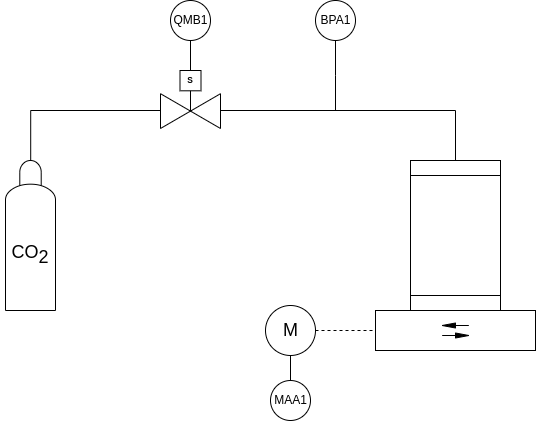
</picture>

**Figura 1.1: P&ID del carbonatador.**

### 1.3. Descripción del proceso
En el proceso de elaboración de la cerveza una de las últimas etapas es la carbonatación, donde se incorpora
dióxido de carbono a lı́quido para crear efervescencia, realzar el sabor, conservar la cerveza y otros propósitos.
En el caso actual la carbonatación se realiza artificialmente mediante la incorporación forzada del gas.
El procedimiento se basa en la iteración de las siguientes dos fases, estructuradas según el patrón de diseño
ISA S88 [1]:

* Inyección de CO2: Accionando la válvula solenoide (normalmente cerrada) (QMB1) se inyecta CO2 al barril
de cerveza. La cantidad de gas inyectado se mide a través de la presión del barril (BPA1).

* Disolución del CO2: Encendiendo la criba vibratoria (MAA1) se agita la cerveza y se favorece la disolución
del CO2. El grado de disolución se mide indirectamente a través de la presión del barril (BPA1). A medida
que el CO2 se diluye en la cerveza BPA1 decrece y se establece en un determinado valor. Se asume que se
completó la disolución cuando dos muestras sucesivas de BPA1 con una separación de 1s difieren en menos
de 10 mbar.

#### 1.3.1. Receta

La receta que se requiere automatizar para lograr la carbonatación completa de un barril estándar se describe
a continuación en pasos numerados y se muestra gráficamente en el diagrama de flujo de la figura 1.2.

1. Se inyectan 3 bares de CO2 al barril accionando QMB1 hasta que BPA1 = 3 bar.
2. Se diluye el CO2 encendiendo la criba vibratoria. Si una vez diluido el gas se mide 0,9 bar < BPA1 < 1 bar
entonces se finaliza la receta con el barril correctamente carbonatado, sino si BPA1 < 0,9 bar se pasa al
paso 3.
3. Se inyectan 2 bares de CO2 .
4. Se diluye el CO2 y si 0,9 bar < BPA1 < 1 bar se finaliza satisfactoriamente la receta, sino si BPA1 < 0,9 bar
se pasa al paso 5.
5. Se inyecta 1 bar de CO2 .
6. Se diluye el CO2 y si 0,9 bar < BPA1 < 1 bar se finaliza satisfactoriamente la receta, sino si BPA1 < 0,9 bar
se repiten los pasos 5 y 6 indefinidamente.
En los pasos 2, 4 y 6 la condición BPA1 > 1 bar detiene la receta dado que no deberı́a producirse si el sistema
funciona adecuadamente. Se debe revisar el equipo.

<picture>
    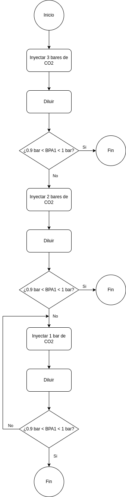
</picture>

**Figura 1.2: Diagrama de flujo de la receta de carbonatación.**

#### 1.3.2. Interacción del operador

La operación del sistema se basa en la ejecución de la receta de carbonatación, siguiendo el patrón de diseño
de manufactura flexible ISA S88 [1].
El operador controla el estado de la receta a través de los siguientes comandos:

* Start: inicia la receta.
* Stop: detiene la receta.
* Hold: pausa la receta.
* Resume: reanuda la receta.
* Reset: reinicia la receta.

Los comandos se encuentran ligados con los estados de la receta de acuerdo al diagrama de estados de la
figura 1.3.

<picture>
    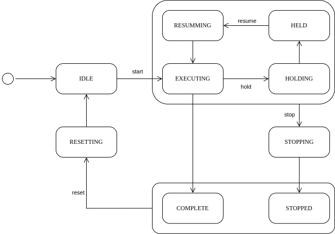
</picture>

**Figura 1.3: Diagrama de estados de la ejecución de la receta de carbonatación.**

### 1.4. Arquitectura de control

El sistema de automatización se basa en una arquitectura de control tı́pica como se muestra en la figura
1.4. Consta de un único controlador controlando el equipo fı́sico, un HMI para operar y el soporte para una
computadora de supervisión con la capacidad de monitorear el proceso, a través de una conexión serie o mediante
un navegador web.

<picture>
    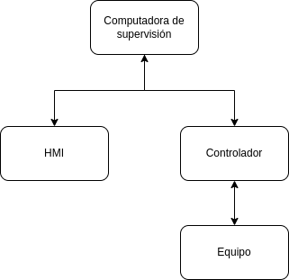
</picture>

**Figura 1.4: Arquitectura de control.**

### 1.5. Análisis de sistemas similares en el mercado
En el mercado los carbonatadores que se venden son generalmente del tipo inline, para volúmenes altos
de producción. El sistema a automatizar maneja volúmenes de producción bajos y por ende el carbonatador
implementado opera directamente sobre los barriles. Sin embargo, se analizan tres sistemas de carbonatación
comerciales para comparar las caracterı́sticas de cada uno, en la tabla 1.1 se muestran los resultados de este
análisis.

Los productos analizados se pueden encontrar en los siguientes enlaces:

* [ProCarb™ Mini](https://www.probrew.com/products/procarb-mini/)
* [Pentair Carbonation Control System](https://foodandbeverage.pentair.com/en/products/pentair-carbonation-control-system-carbo-controller-ccr?utm_source=google&utm_medium=cpc&utm_term=HGB+Carbonator&utm_content=digital_ad&utm_campaign=CCR_awareness_2024)
* [Carboblend](https://www.alfalaval.com/products/process-solutions/brewery-solutions/blending-modules/carboblend/)

<table><thead>
  <tr>
    <th>Característica</th>
    <th>ProCarb™ Mini</th>
    <th>Pentair Carbonation Control System</th>
    <th>Carboblend</th>
  </tr></thead>
<tbody>
  <tr>
    <td>Automático</td>
    <td>Si</td>
    <td>Si</td>
    <td>Si</td>
  </tr>
  <tr>
    <td>HMI</td>
    <td>Si</td>
    <td>Si</td>
    <td>Si</td>
  </tr>
  <tr>
    <td>Compacto</td>
    <td>Si</td>
    <td>Si </td>
    <td>Si</td>
  </tr>
  <tr>
    <td>Medición directa de CO₂</td>
    <td>Si</td>
    <td>Si</td>
    <td>Si</td>
  </tr>
  <tr>
    <td>Comunicación abierta</td>
    <td>Si</td>
    <td>Si</td>
    <td>Si</td>
  </tr>
</tbody>
</table>

**Tabla 1.1: Comparación de carbonatadores comerciales.**

## Capítulo 2. Introducción específica

### 2.1. Requisitos

En la tabla 2.1 se muestran los requisitos del sistema desarrollado.

<table><thead>
  <tr>
    <th>Grupo</th>
    <th>ID</th>
    <th>Descripción</th>
  </tr></thead>
<tbody>
  <tr>
    <td rowspan="4">Control del proceso</td>
    <td>1.1</td>
    <td>Implementación de receta de carbonatación según ISA S88.</td>
  </tr>
  <tr>
    <td>1.2</td>
    <td>Inyección de CO2 mediante válvula solenoide (QMB1).</td>
  </tr>
  <tr>
    <td>1.3</td>
    <td>Disolución de CO2 mediante criba vibratoria accionada por motor eléctrico (MAA1).</td>
  </tr>
  <tr>
    <td>1.4</td>
    <td>Monitoreo de presión (BPA1).</td>
  </tr>
  <tr>
    <td rowspan="6">HMI</td>
    <td>2.1</td>
    <td>Comunicación con MCU.</td>
  </tr>
  <tr>
    <td>2.2</td>
    <td>Indicación de estado de receta.</td>
  </tr>
  <tr>
    <td>2.3</td>
    <td>Indicación de paso de receta.</td>
  </tr>
  <tr>
    <td>2.4</td>
    <td>Indicación de alarmas.</td>
  </tr>
  <tr>
    <td>2.5</td>
    <td>Indicación de presión BPA1.</td>
  </tr>
  <tr>
    <td>2.6</td>
    <td>Botones de comando de receta: start, stop, hold, resume, reset.</td>
  </tr>
  <tr>
    <td rowspan="2">Sirena</td>
    <td>3.1</td>
    <td>Conexión con MCU.</td>
  </tr>
  <tr>
    <td>3.2</td>
    <td>Configuración de la alerta sonora.</td>
  </tr>
  <tr>
    <td rowspan="4">Computadora de supervisión</td>
    <td>4.1</td>
    <td>Comunicación con MCU.</td>
  </tr>
  <tr>
    <td>4.2</td>
    <td>Comandos de receta: start, stop, hold, resume, reset.</td>
  </tr>
  <tr>
    <td>4.3</td>
    <td>Comando de reporte de presión BPA1.</td>
  </tr>
  <tr>
    <td>4.4</td>
    <td>Comando de ayuda al operador.</td>
  </tr>
  <tr>
    <td rowspan="2">Sistema de alarmas y  enclavamientos</td>
    <td>5.1</td>
    <td>Alarma por sobrepresión cuando BP A1 &gt; 4 bar.</td>
  </tr>
  <tr>
    <td>5.2</td>
    <td>Detención del proceso por sobrepresión cuando BP A1 &gt; 4 bar.</td>
  </tr>
  <tr>
    <td rowspan="6">Servidor web</td>
    <td>6.1</td>
    <td>Comunicación WiFi con MCU.</td>
  </tr>
  <tr>
    <td>6.2</td>
    <td>Implementación de servidor HTTP.</td>
  </tr>
  <tr>
    <td>6.3</td>
    <td>Indicación de estado de receta mediante HTML.</td>
  </tr>
  <tr>
    <td>6.4</td>
    <td>Indicación de paso de receta.</td>
  </tr>
  <tr>
    <td>6.5</td>
    <td>Indicación de presión BPA1.</td>
  </tr>
  <tr>
    <td>6.6</td>
    <td>Indicación de alarmas.</td>
  </tr>
</tbody></table>

**Tabla 2.1: Requisitos del sistema automático.**

### 2.2. Casos de uso
En las tablas 2.2, 2.3 y 2.4 se presentan tres casos de uso del sistema representativos de su funcionalidad.

<table><thead>
  <tr>
    <th>Caso de uso</th>
    <th>Inicio de receta de carbonatación</th>
  </tr></thead>
<tbody>
  <tr>
    <td>Descripción</td>
    <td>El operador inicia la receta para carbonatar un barril de cerveza.</td>
  </tr>
  <tr>
    <td>Precondición</td>
    <td>La receta debe estar en el estado Idle y el sistema no debe estar enclavado.</td>
  </tr>
  <tr>
    <td>Flujo principal</td>
    <td>1. El operador selecciona Start en el HMI. 2. El sistema inicia la receta. 3. Se inyecta CO2 y se agita el barril según el algoritmo.</td>
  </tr>
  <tr>
    <td>Flujo alternativo</td>
    <td>Si se detecta BP A1 &gt; 4 bar, se activa la alarma, se detiene el proceso y se notifica al operador.</td>
  </tr>
</tbody>
</table>

**Tabla 2.2: Caso de uso 1, inicio de la ejecución de la receta.**

<table><thead>
  <tr>
    <th>Caso de uso</th>
    <th>Pausa y reanudación de receta</th>
  </tr></thead>
<tbody>
  <tr>
    <td>Descripción</td>
    <td>El operador pausa temporalmente la receta en ejecución y luego la reanuda.</td>
  </tr>
  <tr>
    <td>Precondición</td>
    <td>La receta debe estar en el estado Executing.</td>
  </tr>
  <tr>
    <td>Flujo principal</td>
    <td>1. El operador selecciona Hold en el HMI. 2. El sistema detiene la operación de los actuadores. 3. Posteriormente, selecciona Resume para continuar.</td>
  </tr>
  <tr>
    <td>Flujo alternativo</td>
    <td>Si la presión en el barril cambia mientras está pausado, se realiza una notificación visual en el HMI. </td>
  </tr>
</tbody>
</table>

**Tabla 2.3: Caso de uso 2, pausa y reanudación de receta.**

<table><thead>
  <tr>
    <th>Caso de uso</th>
    <th>Reporte de presión BPA1 a la computadora de supervisión.</th>
  </tr></thead>
<tbody>
  <tr>
    <td>Descripción</td>
    <td>El operador se conecta a la computadora de supervisión comandando el reporte de la presión BPA1.</td>
  </tr>
  <tr>
    <td>Precondición</td>
    <td>La computadora de supervisión debe estar conectada a la interfaz UART.</td>
  </tr>
  <tr>
    <td>Flujo principal</td>
    <td>1. El operador envı́a el comando ’r’ para inicial el reporte de la presión. 2. Se envı́a la presión BPA1 en un payload de JSON. 3. El operador envı́a el comando ’R’ para detener el reporte de la presión.</td>
  </tr>
  <tr>
    <td>Flujo alternativo</td>
    <td>-</td>
  </tr>
</tbody>
</table>

**Tabla 2.4: Caso de uso 3, reporte de presión BPA1 a la computadora de supervisión a través del terminal serie.**

### 2.3. Descripción de módulos utilizado
En base a la arquitectura de control y los requisitos establecidos se decidió por utilizar los módulos que se
describen a continuación.

#### 2.3.1. Módulo del microcontrolador
Se utilizó como módulo microcontrolador la placa NUCLEO-F429ZI [5], equipada con un microcontrolador
STM32F429ZI, figura 2.1.

Los principales puntos tenidos en cuenta para la adopción de esta placa son:

* Rendimiento y recursos: El STM32F429ZI incluye un núcleo ARM Cortex-M4 de alto rendimiento con
capacidad de punto flotante, ideal para realizar cálculos en tiempo real y ejecutar múltiples tareas si-
multáneamente.
* Periféricos integrados: La placa cuenta con una amplia gama de periféricos como UART, SPI, ADC y GPIO,
que permiten una integración eficiente con los sensores y actuadores del sistema.
* Compatibilidad con herramientas de desarrollo: La placa es compatible con Mbed OS y herramientas como
STM32CubeIDE, lo que facilita el desarrollo del software.
* Documentación y soporte: La disponibilidad de documentación detallada simplifica el proceso de imple-
mentación y resolución de problemas.

<picture>
    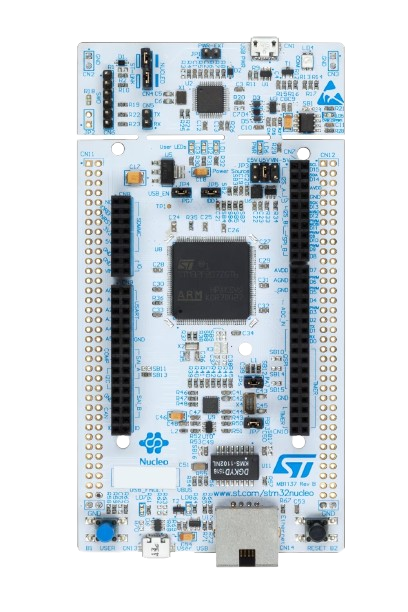
</picture>

**Figura 2.1: NUCLEO-F429ZI.**

#### 2.3.2. Módulo del display táctil
Para la implementación del HMI se utilizó el módulo display [4] con pantalla LCD TFT de 2.4’ y drivers de
hardware ILI9341 y XPT2046 que se muestra en la figura 2.2.
El comando gráfico del LCD se realiza con el hardware ILI9341 a través de una comunicación SPI y el comando
de la interacción táctil con el hardware XPT2046 también a través de una comunicación SPI.

<picture>
    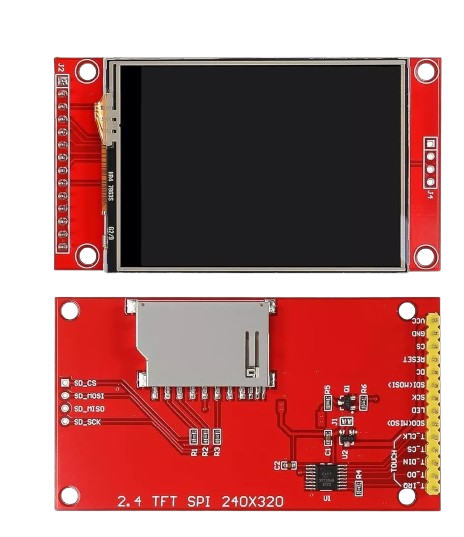
</picture>

**Figura 2.2: Modulo display táctil.**

#### 2.3.3. Módulo Wi-Fi
Para la implementación de la comunicación con la computadora de supervisión a través de un navegador web
se utiliza el módulo Wi-Fi ESP01 [2] de la figura 2.3.
Este módulo se comunica con el microcontrolador a través de una interfaz UART y la configuración del mismo
se realiza a través de comandos AT.

<picture>
    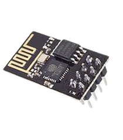
</picture>

**Figura 2.3: Modulo ESP01.**

#### 2.3.4. Buzzer
Para las indicaciones auditivas se utiliza el buzzer pasivo KY-006 que se muestra en la figura 2.4. El dispositivo
se activa enviando una señal PWM al terminal de entrada.

<picture>
    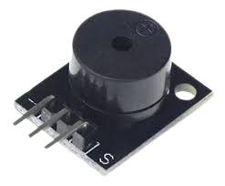
</picture>

**Figura 2.4: Buzzer.**

#### 2.3.3. Módulo de alimentación
Para la alimentación de los módulos de display, Wi-Fi y el buzzer se utiliza el módulo MB102 que se muestra
en la figura 2.5. El dispositivo genera 3,3 V al conectar el USB de entrada a 5 V .

<picture>
    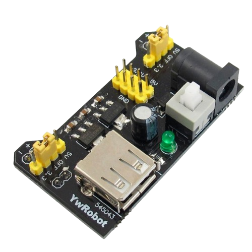
</picture>

**Figura 2.5: Módulo de alimentación MB102.**

## Capítulo 3. Diseño e implementación

### 3.1.Hardware

#### 3.1.1. Diagrama en bloques
En la figura 3.1 se muestra un diagrama en bloques del hardware del sistema de automatización desarrollado.

<picture>
    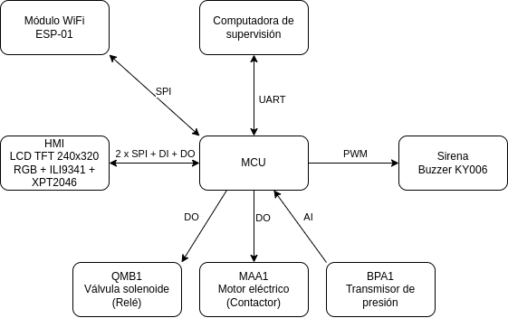
</picture>

**Figura 3.1: Diagrama en bloque del sistema.**

#### 3.1.2. Lista de señales
En la tabla 3.1 se listan las señales del sistema, indicando la conexión de los puertos de la placa NUCLEO-
F429ZI a los módulos de hardware, los relé de accionamiento del motor MAA1 y la válvula QMB1 y la entrada
analógica del sensor de presión BPA1.

<table><thead>
  <tr>
    <th colspan="2">Pin del módulo de hardware</th>
    <th colspan="2">Pin de la placa Nucleo-F429ZI</th>
  </tr></thead>
<tbody>
  <tr>
    <td rowspan="6">ILI9341</td>
    <td>MISO</td>
    <td>PB4</td>
    <td>SPI1\_MISO</td>
  </tr>
  <tr>
    <td>SCKL</td>
    <td>PB3</td>
    <td>SPI1\_SCK</td>
  </tr>
  <tr>
    <td>MOSI</td>
    <td>PB5</td>
    <td>SPI1\_MOSI</td>
  </tr>
  <tr>
    <td>CS</td>
    <td>PA4</td>
    <td>SPI1\_CS</td>
  </tr>
  <tr>
    <td>DCX</td>
    <td>PC7</td>
    <td>DO</td>
  </tr>
  <tr>
    <td>RESX</td>
    <td>PA15</td>
    <td>DO</td>
  </tr>
  <tr>
    <td rowspan="5">XPT2046</td>
    <td>MISO</td>
    <td>PC2</td>
    <td>SPI2\_MISO</td>
  </tr>
  <tr>
    <td>SCKL</td>
    <td>PB13</td>
    <td>SPI2\_SCK</td>
  </tr>
  <tr>
    <td>MOSI</td>
    <td>PB15</td>
    <td>SPI2\_MOSI</td>
  </tr>
  <tr>
    <td>CS</td>
    <td>PB12</td>
    <td>SPI2\_CS</td>
  </tr>
  <tr>
    <td>PENIRQ</td>
    <td>PC6</td>
    <td>DI</td>
  </tr>
  <tr>
    <td>Siren</td>
    <td>Signal</td>
    <td>PA3</td>
    <td>PWM2/4</td>
  </tr>
  <tr>
    <td rowspan="3">ESP01</td>
    <td>Tx</td>
    <td>PD5</td>
    <td></td>
  </tr>
  <tr>
    <td>Rx</td>
    <td>PD6</td>
    <td></td>
  </tr>
  <tr>
    <td>Enable</td>
    <td>PD7</td>
    <td></td>
  </tr>
  <tr>
    <td>BPA1</td>
    <td>Signal</td>
    <td>PC0</td>
    <td>AI</td>
  </tr>
  <tr>
    <td>MAA1</td>
    <td>Relay</td>
    <td>PB0</td>
    <td>DO</td>
  </tr>
  <tr>
    <td>QMB1</td>
    <td>Relay</td>
    <td>PB7</td>
    <td>DO</td>
  </tr>
</tbody></table>

**Tabla 3.1: Lista de señales del sistema.**

#### 3.1.3. Pantalla del HMI
La pantalla del HMI implementada se muestra en la figura 3.2. A través de los botones táctiles se controla la
ejecución de la receta y con los indicadores se monitorea el estado.

<picture>
    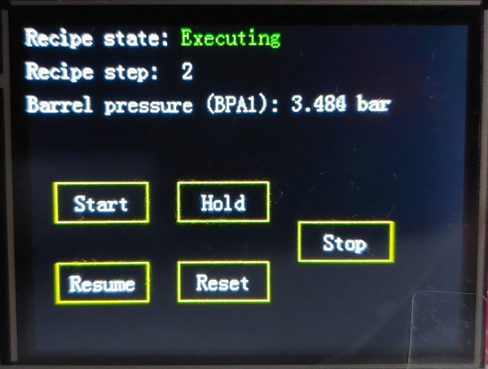
</picture> 

**Figura 3.2: Pantalla del HMI.**

### 3.2. Firmware

#### 3.2.1. Repositorio
Todo el código del proyecto se encuentra en el repositorio git en [7].

#### 3.2.2. Tecnologı́a
El firmware del proyecto se desarrolla en el sistema operativo Mbed en lenguaje C++. Como compilador se
utilizó la toolchain ARM-GNU.

#### 3.2.3. Estructura del repositorio
El repositorio git se divide en las siguientes carpetas y archivos:

* doc: Documentación del proyecto.
* include: Archivos de cabecera de c++.
* lib: Bibliotecas externas. Contiene la librerı́a mbed-os como submodulo de git.
* src: Archivos fuente de c++.
* test: Archivos de soporte para pruebas de software.
* CMakeLists.txt: Archivo de compilación de cmake.
* Doxyfile: Archivo de configuración de la documentación Doxygen.
* mbed app.json: Archivo de configuración de mbed.
* mbed-os.lib: Archivo de configuración de mbed.

#### 3.2.4. Documentación
El código fuente se encuentra documentado con Doxygen, ver instrucciones en [7] para su generación. En el
presente documento se muestran detalles de alto nivel de las clases, recurrir a esta documentación en caso de
requerir mayor detalle.

#### 3.2.5. Compilación
El proyecto se compiló utilizando la toolchain de código libre ARM-GNU, ver instrucciones en [7].

#### 3.2.6. Arquitectura
En la figura 3.3 se muestra el diagrama UML del sistema. La clase contenedora es BeerCarbonationSystem.
Los módulos se comunican entre sı́ adquiriendo referencias de los objetos necesarios.

<picture>
    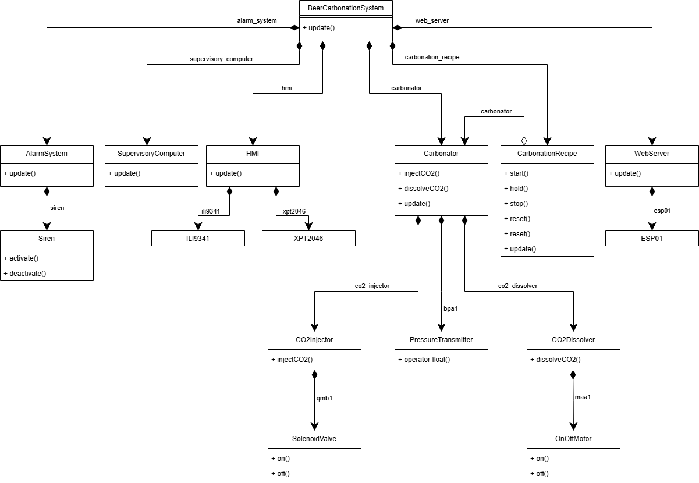
</picture> 

**Figura 3.3: Diagrama UML del sistema.**

#### 3.2.7. Clase BeerCarbonationSystem
La clase BeerCarbonationSystem implementa la lógica de una célula de proceso para la carbonatación de
cerveza, siguiendo el patrón de diseño ISA S88. Esta clase gestiona la interfaz de usuario, ejecuta las recetas de
carbonatación y controla los equipos relacionados con el proceso.

#### 3.2.8. Clase CarbonationRecipe
La clase CarbonationRecipe implementa la receta de carbonatación de acuerdo al patrón ISA S88, permitiendo
el control del estado de acuerdo a la máquina de estados de la figura 3.4.
Implementa el enclavamiento de protección en caso de sobrepresión BP A1 > 4 bar, deteniendo el proceso y
evitando su reanudación hasta que esta condición desaparezca.

<picture>
    
</picture> 

**Figura 3.4: Diagrama de estados de la clase CarbonationRecipe.**

Dentro del estado EXECUTING se encuentra la máquina de estados de la figura 3.5 que implementa la receta
por pasos:

<picture>
    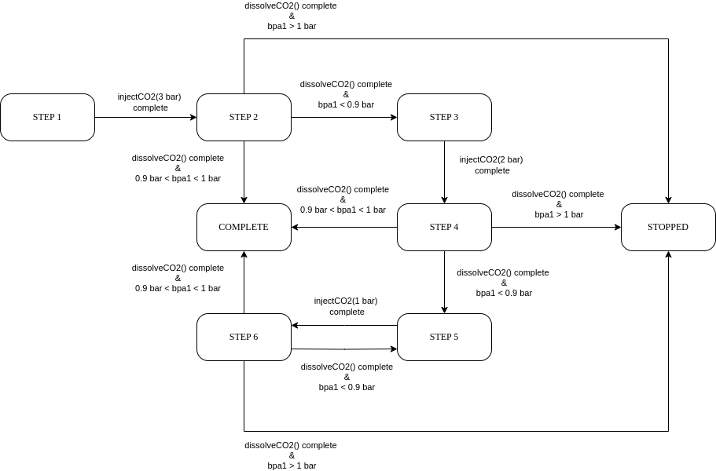
</picture>

**Figura 3.5: Diagrama de estados de los pasos de la receta de carbonatación.**

#### 3.2.9. Clase Carbonator
Implementa el modelo del equipo carbonatador, corresponde a una unit del modelo ISA S88. Se encarga
de propagar las señales entre los equipos de la unidad y el gestor de la receta, ofreciendo una interfaz para la
ejecución de sus fases.

#### 3.2.10. Clase CO2Injector
Implementa la fase de inyección de CO2 al barril de la figura 3.6 permitiendo configurar la presión deseada
por parámetro.

<picture>
    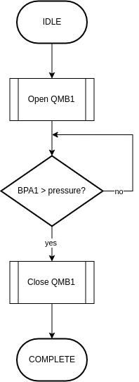
</picture> 

**Figura 3.6: Diagrama de flujo de la fase de inyección de CO2.**

Internamente contiene una máquina de estados como la de la figura 3.4 que indica el estado del equipo
siguiendo el estado de la receta y una máquina de estados por pasos para implementar la lógica de la fase en el
estado EXECUTING.

#### 3.2.11. Clase CO2Dissolver
Implementa la fase de disolución de CO2 al barril de la figura 3.7.

<picture>
    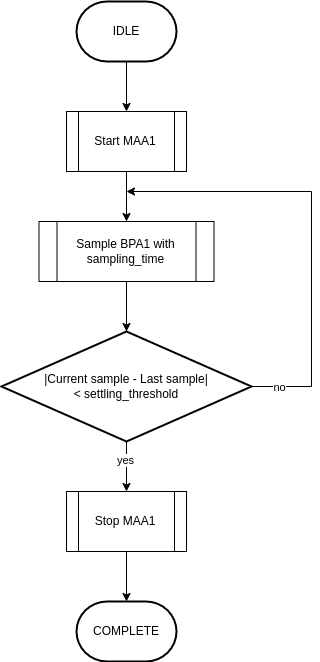
</picture> 

**Figura 3.7: Diagrama de flujo de la fase de disolución de CO2.**

Internamente contiene una máquina de estados como la de la figura 3.4 que indica el estado del equipo
siguiendo el estado de la receta y una máquina de estados por pasos para implementar la lógica de la fase en el
estado EXECUTING.

#### 3.2.12. Clase PressureTransmitter
La clase PressureTransmitter está diseñada para leer y convertir una señal analógica proveniente de un
transmisor de presión en una magnitud de presión. Utiliza un pin de entrada analógica para leer el valor de la
señal y luego escala este valor para obtener la presión en unidades de presión.

El tranmisor tiene un rango de 0 a 5 bar y produce señales de tensión de 0 a 3,3 V .

**Componentes principales:**
* pressure signal: Es un objeto de tipo AnalogIn, que representa el pin analógico al que está conectada la
señal del transmisor de presión. Se utiliza para leer el valor de la señal analógica.

#### 3.2.13. Clase OnOffMotor
La clase OnOffMotor controla un motor que puede ser encendido o apagado con un control binario. La clase
maneja los estados del motor y proporciona un control suave, gestionando los tiempos de respuesta del motor
cuando cambia entre los estados de encendido y apagado.

La máquina de estados implementada por esta clase se muestra en la figura 3.8.

<picture>
    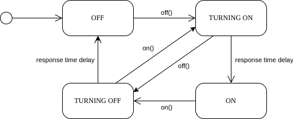
</picture> 

**Figura 3.8: Diagrama de estados de la clase OnOffMotor.**

**Componentes principales:**
* on actuating signal: objeto que controla el pin de salida digital conectado al motor o válvula solenoide. El
valor de este pin determina si el motor está encendido (true) o apagado (false).
* response time: El tiempo de respuesta del motor, que define cuánto tiempo tarda en cambiar de estado de
encendido o apagado. Este parámetro es útil para gestionar transiciones suaves entre los estados.

#### 3.2.14. Clase SolenoidValve
El propósito de la clase SolenoidValve es proporcionar un control sencillo y eficiente de una válvula solenoide,
permitiendo su activación o desactivación con una señal binaria. La clase asegura que las transiciones entre los
estados de la válvula (abierta y cerrada) se realicen de manera controlada, teniendo en cuenta el tiempo de
respuesta de la válvula.

La máquina de estados implementada por esta clase se muestra en la figura 3.9.

<picture>
    
</picture> 

**Figura 3.9: Diagrama de estados de la clase SolenoidValve.**

**Componentes principales:**
* on actuating signal: objeto que controla el pin de salida digital conectado al motor o válvula solenoide. El
valor de este pin determina si el motor está encendido (true) o apagado (false).
* response time: El tiempo de respuesta de la válvula solenoide, que define cuánto tiempo tarda en cambiar de
estado de encendido o apagado. Este parámetro es útil para gestionar transiciones suaves entre los estados.

#### 3.2.15. Clase AlarmSystem
La clase AlarmSystem implementa el sistema de alarmas del proceso de carbonatación. Su principal función
es monitorear las condiciones crı́ticas definidas en el proceso y activar alarmas en caso de detectar situaciones
anómalas.

El sistema incluye un registro de alarmas que se evalúan periódicamente, activando una sirena en caso de que
alguna alarma esté activa.

**Alarmas implementadas:**
* Sobrepresión del barril: Se activa cuando la presión del sensor BPA1 excede los 4

**Componentes principales:**
* Registro de alarmas: Cada alarma está definida por un mensaje descriptivo, una condición de activación
(trigger) y un estado actual (ACTIVA o INACTIVA).
* Siren: Buzzer que se activa en caso de alarmas activas.

#### 3.2.16. Clase Siren
La clase Siren controla una sirena mediante una señal PWM (Pulse Width Modulation). Permite activar o
desactivar la sirena y configurar la frecuencia de su tono. Es utilizada como un mecanismo de notificación acústica en el sistema.

**Componentes principales:**
* on actuating signal: Señal PWM utilizada para controlar la sirena.
* Frecuencia del tono: Configurable dinámicamente para ajustar el sonido emitido por la sirena.

#### 3.2.17. Clase HMI
La clase HMI gestiona la interfaz de usuario del sistema de carbonatación, controlando la pantalla LCD y la
interacción táctil para monitorear y controlar el proceso de carbonatación.

**Componentes principales:**
* LCD driver ILI9341: Se utiliza para mostrar información al usuario, como el estado de la receta, la presión
del barril y los pasos del proceso de carbonatación.
* Driver táctil XPT2046: Permite la interacción táctil del usuario con la interfaz, detectando toques y gestos
en la pantalla.

#### 3.2.18. Clase ILI9341
La clase ILI9341 es una implementación para controlar una pantalla LCD basada en el controlador ILI9341.
Utiliza una comunicación SPI para interactuar con el hardware y proporciona métodos para dibujar pı́xeles, lı́neas,
rectángulos, imágenes y llenar la pantalla con un color especı́fico. También incluye funciones de inicialización y
control de la pantalla.

**Componentes principales:**
* SPI: Interfaz de comunicación para enviar y recibir datos.
* CS (Chip Select): Pin para seleccionar el dispositivo ILI9341.
* DCX (Data/Command): Pin para indicar si se están enviando datos o comandos.
* RESX (Reset): Pin para realizar un reset hardware en la pantalla.

#### 3.2.19. Clase XPT2046
La clase XPT2046 proporciona la interfaz para interactuar con el controlador táctil de la pantalla, que utiliza
el chip XPT2046. Esta clase maneja la comunicación SPI y las interrupciones para detectar eventos táctiles, como
presionar y soltar.

**Componentes principales:**
* SPI: Interfaz de comunicación para enviar y recibir datos.
* CS (Chip Select): Pin para seleccionar el dispositivo ILI9341.
* penirq (Pin de Interrupción): Pin de interrupción que detecta eventos táctiles, como cuando la pantalla
es tocada o liberada. Utiliza una interrupción externa para activar funciones de callback definidas por el
usuario, lo que permite responder a los eventos de toque en tiempo real.
* Callback para eventos táctiles: Funciones que se ejecutan cuando se detecta que la pantalla ha sido tocada
(onTouchPressed) o cuando el toque ha sido liberado (onTouchReleased). Estas funciones son proporciona-
das por el usuario al crear el objeto de la clase XPT2046.

#### 3.2.20. Clase WebServer
La clase WebServer gestiona la comunicación entre el sistema de carbonatación y un servidor web, permitiendo
la visualización remota del estado del proceso de carbonatación a través de una interfaz web. Utiliza un módulo
ESP01 para la conexión Wi-Fi y la transmisión de información.

**Componentes principales:**
*esp01: Objeto que representa el módulo ESP01, responsable de la conexión Wi-Fi y la gestión de solicitudes
HTTP.

#### 3.2.21. Clase ESP01
La clase ESP01 gestiona la comunicación con el módulo Wi-Fi ESP01, permitiendo la conexión a una red
Wi-Fi, la recepción de solicitudes HTTP y el envı́o de respuestas. Utiliza comandos AT para interactuar con el
ESP01 y establece una conexión en modo estación, permitiendo la interacción con un servidor web.

**Componentes principales:**
* uart: Interfaz UART para la comunicación serial con el módulo ESP01, configurada a 115200 baudios.
* enable: Salida digital para habilitar o deshabilitar el módulo ESP01.

#### 3.2.22. Clase SupervisoryComputer
La clase SupervisoryComputer permite conectar un operador al sistema de carbonatación de cerveza, faci-
litando la supervisión y control remoto del proceso. A través de una interfaz UART, el operador puede enviar
comandos para iniciar, detener, pausar, reanudar o restablecer el proceso de carbonatación. Además, esta clase
permite obtener reportes en tiempo real sobre el estado del proceso, como la presión de la carbonatación, sin ser
directamente responsable de ejecutar el proceso de carbonatación en sı́.

**Componentes principales:**
* uart (Interfaz UART):La comunicación entre el operador y el sistema se realiza a través de una interfaz
UART a 9600 baudios. El operador envı́a comandos al sistema, y el sistema responde con información o
reportes, lo que permite al operador supervisar el estado del proceso. ReportingState:Esta enumeración
gestiona el estado de los reportes. Los reportes pueden estar en estado REPORTING”(enviando datos)
o ÏDLE” (sin reportar). El estado de reporte permite al operador recibir información periódica sobre el
proceso.

## Capítulo 4. Ensayos y resultados

### 4.1. Pruebas funcionales del hardware
Las pruebas funcionales del hardware se realizaron por módulos.

### 4.1.1. Módulo Wi-Fi ESP01
Se conectó el módulo a la placa y en paralelo un analizador de protocolos para verificar el correcto envı́o de
comandos y la recepción de respuestas.

### 4.1.2. Módulo HMI
Se conectó el módulo a la placa y se realizó la calibración del display mediante la graficación de puntos.
Adicoinalmente se conectó un analizador de protocolos en los pines de comunicación ambos SPI para verificar el
correcto envı́o de comandos y la recepción de respuestas.

### 4.1.3. Módulo buzzer
Se conectó el buzzer al terminal de masa y se le envı́o una señal PWM con la placa nucleo verificando el
correcto funcionamiento.

### 4.1.4. Transmisor de presión
El transmisor de presión se simuló mediante un potenciometro de 50 kΩ. Se conectó el mismo a los 3,3 V
generados por la placa y se verificó que el valor medido por el objeto AnalogIn sea consistente con las mediciones
realizadas con multı́metro.

### 4.1.5. Módulo de alimentación
Se conectó el módulo de alimentación al protoboard y a la fuente de 5 V . Se verificó mediante una medición
de voltı́metro que la tensión generada era de 3,3 V .
4.1.6.

### Motor MAA1 y válvula solenoide QMB1
Para demostrar el correcto funcionamiento de las salidas digitales correspondientes al motor MAA1 y QMB1
se conectaron sus salidas a los LEDs 1 y 2 de la placa NUCLEO.

### 4.1.7. Pruebas funcionales del firmware
Las pruebas funcionales del firmware se realizaron en conjunto con las distintas pruebas para los módulos de
hardware.
La lógica de la receta se verificó mediante el uso del debugger.

### 4.1.8. Pruebas de integracion
Las pruebas de integración realizadas se encuentran en formato de video en [6].

Se verificó:
* Disposición del hardware.
* Lógica de la receta y respuesta a comandos.
* Comandos mediante la computadora de supervisión por terminal serie.
* Monitoreo mediante el servidor web.
* Alarmas y enclavamientos.

### 4.1.9. Cumplimiento de requisitos
En la tabla 4.1 se presenta la evaluación del cumplimiento de los requisitos iniciales de la tabla 2.1. Se evaluó
a el estado actual de cada uno indicando en verde aquellos que ya fueron cumplidos y en rojo los requerimientos
no cumplidos.

<picture>
    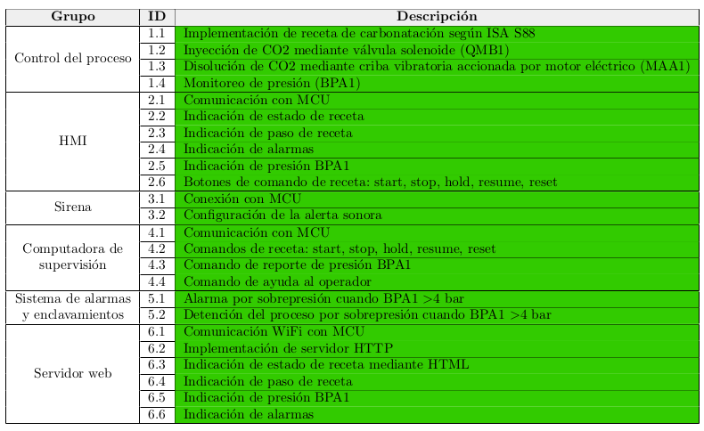
</picture> 

**Tabla 4.1: Estado de los requisitos.**

### 4.2. Documentación del desarrollo realizado

<table><thead>
  <tr>
    <th>Elemento</th>
    <th>Referencia</th>
  </tr></thead>
<tbody>
  <tr>
    <td>Presentación del proyecto</td>
    <td>Capı́tulo 1</td>
  </tr>
  <tr>
    <td>Listado de requisitos</td>
    <td>Tabla 2.1</td>
  </tr>
  <tr>
    <td>Casos de uso del proyecto</td>
    <td>Tablas 2.2 a 2.3</td>
  </tr>
  <tr>
    <td>Diagrama en bloques del sistema</td>
    <td>Figura 3.1</td>
  </tr>
  <tr>
    <td>Lista de señales</td>
    <td>Tabla 3.1</td>
  </tr>
  <tr>
    <td>Implementación del hardware</td>
    <td>Sección 3.1</td>
  </tr>
  <tr>
    <td>Módulos de software</td>
    <td>Sección 3.2</td>
  </tr>
  <tr>
    <td>Repositorio</td>
    <td>[7]</td>
  </tr>
  <tr>
    <td>Cumplimiento de requisitos</td>
    <td>Tabla 4.1</td>
  </tr>
  <tr>
    <td>Conclusiones finales</td>
    <td>Capı́tulo 5</td>
  </tr>
</tbody>
</table>

**Tabla 4.2: Elementos del sumario del sistema automático para el sistema de carbonatación de cerveza.**

## Capı́tulo 5 Conclusiones

### 5.1. Resultados obtenidos
El sistema desarrollado en base al patrón de diseño de ISA S88 resulta mantenible, escalable y extensible.
Por otro lado, implementar el proyecto en mbed aceleró los tiempos de desarrollo pero significó una perdida
de dominio en cuanto a conocimiento interno del sistema operativo.

Teniendo en cuenta que el soporte para mbed finaliza en 2026 es conveniente migrar el código para utilizar
solo la libreria STM32CubeF4.

### 5.2. Próximos pasos

* Migrar el código desde mbed a la librerı́a STM32CubeF4.
* Crear un worflow con la toolchain ARM-GNU de forma de independizarse de los IDE para automatizar
tareas y lograr control total del proceso.
* Crear y automatizar pruebas unitarias y de integración mediante un esquema xUnit.
* Refactorizar la clase WebServer para gestionar mejor los tiempos de espera y la latencia de las peticiones.

## Bibliografı́a

[1] Brandl, Dennis. Design Patterns for Flexible Manufacturing. (ISA, 2007).

[2] Shenzhen Anxinke Technology CO. ESP-01 WiFi Module. (2015). Disponible en https://www.
microchip.ua/wireless/esp01.pdf al [12/12/2024].

[3] International Electrotechnical Commission. IEC 81346-2:2019: Industrial systems, installations and
equipment and industrial products — Structuring principles and reference designations — Part 2: Classifica-
tion of objects and codes for classes. (IEC, 2019).

[4] LCD wiki. 2.8inch SPI Module ILI9341 SKU:MSP2807. Disponible en http://www.lcdwiki.com/2.8inch_
SPI_Module_ILI9341_SKU:MSP2807 al [12/12/2024].

[5] ST Microelectronics. NUCLEO-F429ZI. Disponible en https://www.st.com/en/evaluation-tools/
nucleo-f429zi.html al [12/12/2024].

[6] Bailo, Hernán L.. Pruebas de integración del sistema Beer Carbonation System. Disponible en https://drive.google.com/drive/folders/1NrQh9VOOGA5issQOtzWXVuDIw9n37sIr?usp=sharing al [12/12/2024].

[7] Bailo, Hernán L.. Beer Carbonation System. Disponible en https://github.com/hbailo/beer-carbonation-system
al [12/12/2024].
