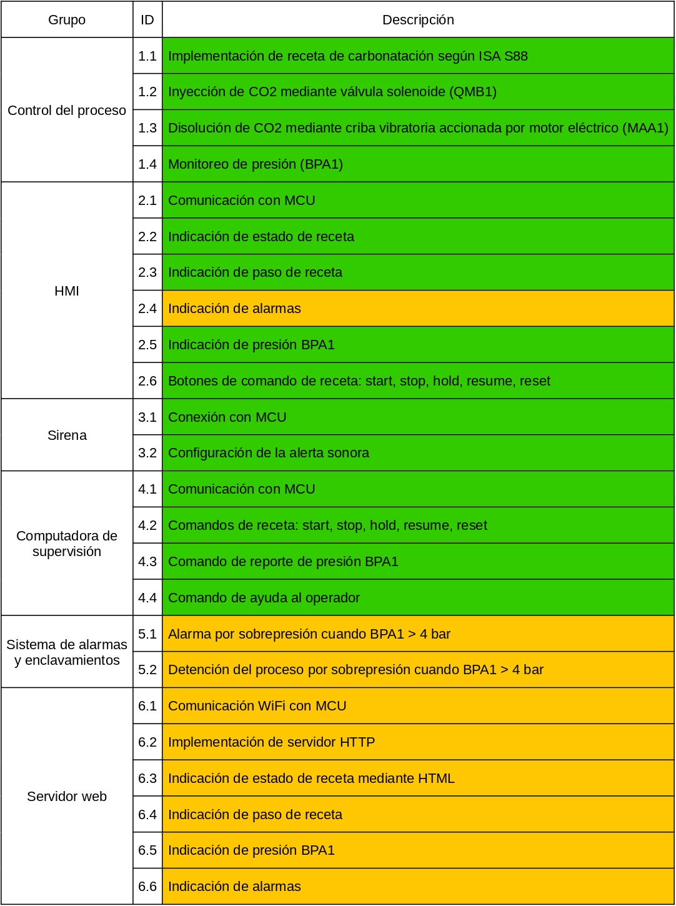

# Sistema de carbonatación de cerveza

**Informe de avance**

**Autor:** Hernán Leandro Bailo

**Padrón:** 97841

**Fecha:** 2° cuatrimeste del 2024

## Cumplimiento de los requerimientos

En base a los requerimientos planteados en la definición del proyecto, archivo `requirements-and-use-cases.md` de la carpeta `doc`, se evalúa el estado actual de cada uno indicando en verde aquellos que ya fueron cumplidos, en amarillo los que aún no fueron cumplidos pero se proyecta que será posible hacerlo, y en rojo los requerimientos que no serán cumplidos. El estado de los requerimientos se muestra en la tabla 1.

<picture>
    
</picture>

**Tabla 1: Estado de los requerimientos.**
