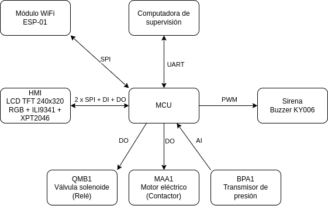

# Sistema de carbonatación de cerveza

**Autor:** Hernán Leandro Bailo

**Padrón:** 97841

**Fecha:** 2° cuatrimeste del 2024

## 1 Selección de proyecto

### 1.1 Análisis de alternativas

Inicialmente se analizaron dos posibles alternativas de proyecto:

* Sistema de riego doméstico inteligente.

* Sistema de carbonatación de cerveza en barriles.

Las alternativas se evaluaron en base al puntaje otorgado en las siguientes categorías:

1) Utilidad económica: satisfacción del consumidor del sistema.
3) Indisponibilidad de alternativas: falta de sistemas similares en el mercado.
4) Tiempo de desarrollo: extensión del diseño y la implementación.
5) Research & Development: creación de nuevo know how.

En la tabla 1 se muestran los puntajes otorgados a ambos proyectos en estas categorías y el resultado de la suma pesada.

<table class="tg" style="undefined;table-layout: fixed; width: 1239px"><colgroup>
<col style="width: 259px">
<col style="width: 80px">
<col style="width: 180px">
<col style="width: 180px">
<col style="width: 180px">
<col style="width: 180px">
<col style="width: 180px">
</colgroup>
<thead>
  <tr>
    <th class="tg-qbk9" colspan="2">Proyecto</th>
    <th class="tg-qbk9">Utilidad económica (Peso 7)</th>
    <th class="tg-ncfi">Indisponibilidad de alternativas  (Peso 10)</th>
    <th class="tg-ncfi">Tiempo de desarrollo (Peso 5)</th>
    <th class="tg-ncfi">Research &amp; Development (Peso 9)</th>
    <th class="tg-ncfi">Suma de puntajes pesados</th>
  </tr></thead>
<tbody>
  <tr>
    <td class="tg-lboi" rowspan="2">Sistema de riego doméstico inteligente</td>
    <td class="tg-c3ow">Puntaje categoría</td>
    <td class="tg-9wq8">2</td>
    <td class="tg-nrix">4</td>
    <td class="tg-nrix">6</td>
    <td class="tg-nrix">5</td>
    <td class="tg-nrix">-</td>
  </tr>
  <tr>
    <td class="tg-c3ow">Puntaje pesado</td>
    <td class="tg-9wq8">14</td>
    <td class="tg-nrix">40</td>
    <td class="tg-nrix">30</td>
    <td class="tg-nrix">45</td>
    <td class="tg-nrix">129</td>
  </tr>
  <tr>
    <td class="tg-cly1" rowspan="2">Sistema de carbonatación de cerveza</td>
    <td class="tg-baqh">Puntaje categoría</td>
    <td class="tg-nrix">9</td>
    <td class="tg-nrix">10</td>
    <td class="tg-nrix">8</td>
    <td class="tg-nrix">10</td>
    <td class="tg-nrix">-</td>
  </tr>
  <tr>
    <td class="tg-baqh">Puntaje pesado</td>
    <td class="tg-nrix">63</td>
    <td class="tg-nrix">100</td>
    <td class="tg-nrix">40</td>
    <td class="tg-nrix">90</td>
    <td class="tg-nrix">293</td>
  </tr>
</tbody></table>

**Tabla 1: Comparación de las alternativas de proyecto basada en el puntaje de las categorías seleccionadas.**

El proyecto de mayor puntaje pesado y por ende seleccionado para su desarrollo es el Sistema de Carbonatación de Cerveza. A continuación se realiza un análisis de los puntajes asignados a cada categoría.

#### Utilidad económica
Al sistema de carbonatación de cerveza en barriles se le asigna un puntaje de 9 dado que el sistema va a ser utilizado por el dueño del equipo físico que actualmente realiza el procedimiento de forma manual. La automatización del sistema le genera gran utilidad dado que va a poder utilizar el tiempo en otras tareas de la planta a la vez que incrementa los volúmenes de producción y mejora la repetibilidad del proceso.

Al sistema de riego doméstico inteligente se le asigna un puntaje de 2 dado que es un proyecto personal para el riego en mi domicilio y no me es relevante actualmente.

#### Indisponibilidad de alternativas
Al sistema de carbonatación se le asigna un puntaje de 10 dado que el equipo físico ya está opeartivo y el desarrollo del sistema tiene que ser a medida de los instrumentos ya adquiridos.

Al sistema de riego se le asigna un puntaje de 4 dado que existe una amplia gama de productos comerciales de riego.

#### Tiempo de desarrollo
Al sistema de carbonatación se le asigna un puntaje de 8 dado que el sistema debe implementar una receta de manufactura compleja, junto con la interfaz con el operador.

Al sistema de riego se le asigna un puntaje de 6 dado que la lógica del riego a implementar es más directa que para el carbonatador.

#### Research & Development
Al sistema de carbonatación se le asigna un puntaje de 10, frente al 5 del sistema de riego, ya que al ser un equipo a medida y una aplicación menos común se requiere de investigar y desarrollar más otorgando un know how superior.

### 1.2 Objetivo del proyecto seleccionado
Implementar la automatización del sistema de carbonatación de cerveza en barriles que se muestra esquemáticamente en el P&ID de la figura 1.

<picture>
    <source media="(prefers-color-scheme: dark)" srcset="architecture/process-and-instrumentation-diagram-dark.png">
    <source media="(prefers-color-scheme: light)" srcset="architecture/process-and-instrumentation-diagram-light.png"> 
    
</picture>

**Figura 1: P&ID del sistema de carbonatación de cerveza en barriles**

## 2 - Elicitación de requisitos y casos de uso

### 2.1 Productos similares en el mercado
En el mercado los carbonatadores que se venden son generalmente del tipo inline, para volúmenes altos de producción. El sistema a automatizar maneja volúmenes de producción bajos y por ende el carbonatador implementado opera directamente sobre los barriles. Sin embargo, se analizan tres sistemas de carbonatación comerciales para comparar las características de cada uno, en la tabla 2 se muestran los resultados de este análisis.

Los productos analizados se pueden encontrar en los siguientes enlaces:

* [ProCarb™ Mini](https://www.probrew.com/products/procarb-mini/)
* [Pentair Carbonation Control System](https://foodandbeverage.pentair.com/en/products/pentair-carbonation-control-system-carbo-controller-ccr?utm_source=google&utm_medium=cpc&utm_term=HGB+Carbonator&utm_content=digital_ad&utm_campaign=CCR_awareness_2024)
* [Carboblend](https://www.alfalaval.com/products/process-solutions/brewery-solutions/blending-modules/carboblend/)

<table><thead>
  <tr>
    <th>Característica</th>
    <th>ProCarb™ Mini</th>
    <th>Pentair Carbonation Control System</th>
    <th>Carboblend</th>
  </tr></thead>
<tbody>
  <tr>
    <td>Automático</td>
    <td>Si</td>
    <td>Si</td>
    <td>Si</td>
  </tr>
  <tr>
    <td>HMI</td>
    <td>Si</td>
    <td>Si</td>
    <td>Si</td>
  </tr>
  <tr>
    <td>Compacto</td>
    <td>Si</td>
    <td>Si </td>
    <td>Si</td>
  </tr>
  <tr>
    <td>Medición directa de CO₂</td>
    <td>Si</td>
    <td>Si</td>
    <td>Si</td>
  </tr>
  <tr>
    <td>Comunicación abierta</td>
    <td>Si</td>
    <td>Si</td>
    <td>Si</td>
  </tr>
</tbody>
</table>

**Tabla 2: Comparación de carbonatadores comerciales.**

### 2.2 Requerimientos
En la tabla 3 se muestran los requerimientos de la automatización del sistema de carbonatación de cerveza.

<table><thead>
  <tr>
    <th>Grupo</th>
    <th>ID</th>
    <th>Descripción</th>
  </tr></thead>
<tbody>
  <tr>
    <td rowspan="4">Control del proceso</td>
    <td>1.1</td>
    <td>Implementación de receta de carbonatación según ISA S88</td>
  </tr>
  <tr>
    <td>1.2</td>
    <td>Inyección de CO2 mediante válvula solenoide (QMB1)</td>
  </tr>
  <tr>
    <td>1.3</td>
    <td>Disolución de CO2 mediante criba vibratoria accionada por motor eléctrico (MAA1)</td>
  </tr>
  <tr>
    <td>1.4</td>
    <td>Monitoreo de presión (BPA1)</td>
  </tr>
  <tr>
    <td rowspan="6">HMI</td>
    <td>2.1</td>
    <td>Comunicación con MCU</td>
  </tr>
  <tr>
    <td>2.2</td>
    <td>Indicación de estado de receta</td>
  </tr>
  <tr>
    <td>2.3</td>
    <td>Indicación de paso de receta</td>
  </tr>
  <tr>
    <td>2.4</td>
    <td>Indicación de alarmas</td>
  </tr>
  <tr>
    <td>2.5</td>
    <td>Indicación de presión BPA1</td>
  </tr>
  <tr>
    <td>2.6</td>
    <td>Botones de comando de receta: start, stop, hold, resume, reset</td>
  </tr>
  <tr>
    <td rowspan="2">Sirena</td>
    <td>3.1</td>
    <td>Conexión con MCU</td>
  </tr>
  <tr>
    <td>3.2</td>
    <td>Configuración de la alerta sonora</td>
  </tr>
  <tr>
    <td rowspan="4">Computadora de supervisión</td>
    <td>4.1</td>
    <td>Comunicación con MCU</td>
  </tr>
  <tr>
    <td>4.2</td>
    <td>Comandos de receta: start, stop, hold, resume, reset</td>
  </tr>
  <tr>
    <td>4.3</td>
    <td>Comando de reporte de presión BPA1</td>
  </tr>
  <tr>
    <td>4.4</td>
    <td>Comando de ayuda al operador</td>
  </tr>
  <tr>
    <td rowspan="2">Sistema de alarmas y enclavamientos</td>
    <td>5.1</td>
    <td>Alarma por sobrepresión cuando BPA1 &gt; 4 bar</td>
  </tr>
  <tr>
    <td>5.2</td>
    <td>Detención del proceso por sobrepresión cuando BPA1 &gt; 4 bar</td>
  </tr>
  <tr>
    <td rowspan="6">Servidor web</td>
    <td>6.1</td>
    <td>Comunicación WiFi con MCU</td>
  </tr>
  <tr>
    <td>6.2</td>
    <td>Implementación de servidor HTTP</td>
  </tr>
  <tr>
    <td>6.3</td>
    <td>Indicación de estado de receta mediante HTML</td>
  </tr>
  <tr>
    <td>6.4</td>
    <td>Indicación de paso de receta</td>
  </tr>
  <tr>
    <td>6.5</td>
    <td>Indicación de presión BPA1</td>
  </tr>
  <tr>
    <td>6.6</td>
    <td>Indicación de alarmas</td>
  </tr>
</tbody></table>

**Tabla 3: requerimientos del sistema de carbonatación de cerveza.**

En la figura 2 se muestra un diagrama de bloques del sistema diseñado.

<picture>
    <source media="(prefers-color-scheme: dark)" srcset="design/system-block-diagram-dark.png">
    <source media="(prefers-color-scheme: light)" srcset="design/system-block-diagram-light.png"> 
    
</picture>

**Figura 2: Diagrama de bloques del sistema.**

### 2.3 Casos de uso

En la tabla 4 se describen tres casos de uso del sistema.

<table><thead>
  <tr>
    <th>Caso de Uso</th>
    <th>Descripción</th>
    <th>Precondición</th>
    <th>Flujo Principal</th>
    <th>Flujo Alternativo</th>
  </tr></thead>
<tbody>
  <tr>
    <td>Inicio de Receta de Carbonatación</td>
    <td>El operador inicia la receta para carbonatar un barril de cerveza.</td>
    <td>La receta debe estar en el estado Idle y el sistema no debe estar enclavado.</td>
    <td>1. El operador selecciona Start en el HMI. 2. El sistema inicia la receta. 3. Se inyecta CO2 y se agita el barril según el algoritmo.                </td>
    <td>         Si el sensor BPA1 detecta presión &gt; 4 bar, se activa la alarma, se detiene el proceso y se notifica al operador.       </td>
  </tr>
  <tr>
    <td>Pausa y Reanudación del Proceso</td>
    <td>El operador pausa temporalmente la receta en ejecución y luego la reanuda.</td>
    <td>La receta debe estar en el estado Executing.</td>
    <td>1. El operador selecciona Hold en el HMI. 2. El sistema detiene la operación de los actuadores. 3. Posteriormente, selecciona Resume para continuar.                </td>
    <td>         Si la presión en el barril cambia mientras está pausado, se realiza una notificación visual en el HMI.       </td>
  </tr>
  <tr>
    <td>Reporte de presión BPA1 a la computadora de supervisión</td>
    <td>El operador se conecta a la computadora de supervisión comandando el reporte de la presión BPA1.</td>
    <td>La computadora de supervisión debe estar conectada a la interfaz UART</td>
    <td>1. El operador envía el comando 'r' para inicial el reporte de la presión. 2. Se envía la presión BPA1 en un payload de JSON.3 3. El operador envía el comando 'R' para detener el reporte de la presión.         </td>
    <td>-</td>
  </tr>
</tbody></table>

**Tabla 4: subconjunto de casos de uso del sistema.**
