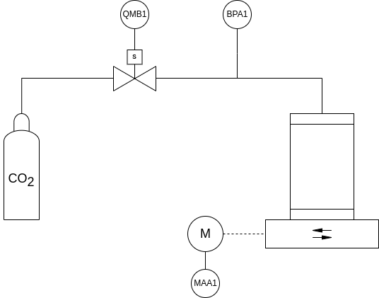

# Sistema de carbonatación de cerveza

**Autor:** Hernán Leandro Bailo

**Padrón:** 97841

**Fecha:** 2° cuatrimeste del 2024

## 1 Selección de proyecto

### 1.1 Análisis de alternativas

Inicialmente se analizaron dos posibles alternativas de proyecto:

* Sistema de riego doméstico inteligente.

* Sistema de carbonatación de cerveza en barriles.

Las alternativas se evaluaron en base al puntaje otorgado en las siguientes categorías:

1) Utilidad económica: satisfacción del consumidor del sistema.
3) Indisponibilidad de alternativas: falta de sistemas similares en el mercado.
4) Tiempo de desarrollo: duración del diseño y la implementación.
5) Research & Development: creación de nuevo know how.

En la tabla 1 se muestran los puntajes otorgados a ambos proyectos en estas categorías y el resultado de la suma pesada.

<table class="tg" style="undefined;table-layout: fixed; width: 1239px"><colgroup>
<col style="width: 259px">
<col style="width: 80px">
<col style="width: 180px">
<col style="width: 180px">
<col style="width: 180px">
<col style="width: 180px">
<col style="width: 180px">
</colgroup>
<thead>
  <tr>
    <th class="tg-qbk9" colspan="2">Proyecto</th>
    <th class="tg-qbk9">Utilidad económica (Peso 7)</th>
    <th class="tg-ncfi">Indisponibilidad de alternativas  (Peso 10)</th>
    <th class="tg-ncfi">Tiempo de desarrollo (Peso 5)</th>
    <th class="tg-ncfi">Research &amp; Development (Peso 9)</th>
    <th class="tg-ncfi">Suma de puntajes pesados</th>
  </tr></thead>
<tbody>
  <tr>
    <td class="tg-lboi" rowspan="2">Sistema de riego doméstico inteligente</td>
    <td class="tg-c3ow">Puntaje categoría</td>
    <td class="tg-9wq8">2</td>
    <td class="tg-nrix">4</td>
    <td class="tg-nrix">6</td>
    <td class="tg-nrix">5</td>
    <td class="tg-nrix">-</td>
  </tr>
  <tr>
    <td class="tg-c3ow">Puntaje pesado</td>
    <td class="tg-9wq8">14</td>
    <td class="tg-nrix">40</td>
    <td class="tg-nrix">30</td>
    <td class="tg-nrix">45</td>
    <td class="tg-nrix">129</td>
  </tr>
  <tr>
    <td class="tg-cly1" rowspan="2">Sistema de carbonatación de cerveza</td>
    <td class="tg-baqh">Puntaje categoría</td>
    <td class="tg-nrix">9</td>
    <td class="tg-nrix">10</td>
    <td class="tg-nrix">8</td>
    <td class="tg-nrix">10</td>
    <td class="tg-nrix">-</td>
  </tr>
  <tr>
    <td class="tg-baqh">Puntaje pesado</td>
    <td class="tg-nrix">63</td>
    <td class="tg-nrix">100</td>
    <td class="tg-nrix">40</td>
    <td class="tg-nrix">90</td>
    <td class="tg-nrix">293</td>
  </tr>
</tbody></table>

**Tabla 1: Comparación de las alternativas de proyecto basada en el puntaje de las categorías seleccionadas.**

El proyecto de mayor puntaje pesado y por ende seleccionado para su desarrollo es el Sistema de Carbonatación de Cerveza. A continuación se realiza un análisis de los puntajes asignados a cada categoría.

#### Utilidad económica
Al sistema de carbonatación de cerveza en barriles se le asigna un puntaje de 9 dado que el sistema va a ser utilizado por el dueño del equipo físico que actualmente realiza el procedimiento de forma manual. La automatización del sistema le genera gran utilidad dado que va a poder utilizar el tiempo en otras tareas de la planta a la vez que incrementa los volúmenes de producción y mejora la repetibilidad del proceso.

Al sistema de riego doméstico inteligente se le asigna un puntaje de 2 dado que es un proyecto personal para el riego en mi domicilio y no me es relevante actualmente.

#### Indisponibilidad de alternativas
Al sistema de carbonatación se le asigna un puntaje de 10 dado que el equipo físico ya está opeartivo y el desarrollo del sistema tiene que ser a medida de los instrumentos ya adquiridos.

Al sistema de riego se le asigna un puntaje de 4 dado que existe una amplia gama de productos comerciales de riego.

#### Tiempo de desarrollo
Al sistema de carbonatación se le asigna un puntaje de 8 dado que el sistema debe implementar una receta de manufactura compleja, junto con la interfaz con el operador.

Al sistema de riego se le asigna un puntaje de 6 dado que la lógica del riego a implementar es más directa que para el carbonatador.

#### Research & Development
Al sistema de carbonatación se le asigna un puntaje de 10, frente al 5 del sistema de riego, ya que al ser un equipo a medida y una aplicación menos común se requiere de investigar y desarrollar más otorgando un know how superior.

### 1.2 Objetivo del proyecto seleccionado
Implementar la automatización del sistema de carbonatación de cerveza en barriles que se muestra esquemáticamente en el P&ID de la figura 1.

<picture>
    <source media="(prefers-color-scheme: dark)" srcset="architecture/process-and-instrumentation-diagram-dark.png">
    <source media="(prefers-color-scheme: light)" srcset="architecture/process-and-instrumentation-diagram-light.png"> 
    
</picture>

**Figura 1: P&ID del sistema de carbonatación de cerveza en barriles**

## 2 - Elicitación de requisitos y casos de uso

### 2.1 Productos similares en el mercado

### 2.2 Requisitos

<picture>
    <source media="(prefers-color-scheme: dark)" srcset="architecture/process-and-instrumentation-diagram-dark.png">
    <source media="(prefers-color-scheme: light)" srcset="architecture/process-and-instrumentation-diagram-light.png"> 
    
</picture>

### 2.3 Casos de uso

